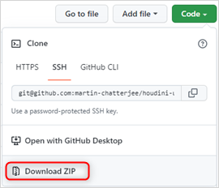
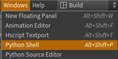
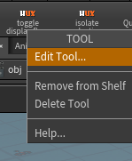
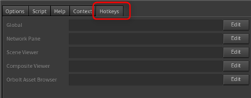

# 

### A collection of **Houdini UX Helpers**:

- **toggleFullScreen**:
  Toggles the Full Screen state of the Houdini Main Window.

- **toggleObjectDisplay**:
  Toggles the visibility of all selected Objects.

- **IsolateSelection**:
  Mimics the Maya/Softimage "Isolate Selection" workflow at the Objects level.

- **QuickDisplay**:
  Let's you store and load active/visible nodes in SOP's.<br/>
  This is intended to sort of mimic the UX behaviour of **Nuke's viewer**
  shortcuts. (--> 1, 2, 3)

- **parent** & **unparent** selected objects

- **reset Transform** of selected objects

- **pickwalking**  (up, down, left, right)

<br/>
<br/>

## Installation

1. **Download** this repo, **unzip** it and **rename** the top folder to `houdini-ux`:\
   \
    _(→ Or just **clone it** of course, if you are git-savvy)_
   <br/>

2. **Copy** ``package_template/houdini_ux.json`` into your **home folder**: `$HOUDINI_USER_PREF_DIR/packages`.\
   _(→ Or into [any other folder](https://www.sidefx.com/docs/houdini/ref/plugins.html#using_packages) where **Houdini package files** will get picked up.)_
   <br/>

3. **Update** the **`HUX_ROOT`** env variable defined inside this ``houdini_ux.json`` file **to your `houdini-ux` location**:\
   
   <br/>
4. **Start** Houdini.
   <br/>
5. **Verify** that the package got picked up:
   - in a **Python Shell** inside Houdini:\
     
     ```python
     >>> import houdini_ux
     >>> print(houdini_ux)
     <module 'houdini_ux' from '/path/to/houdini-ux/python/houdini_ux.py'>
     ```
6. **Display** the **houdini-ux** shelf.
   <br/>
7. **Add Hotkeys** to shelf items, as desired:\
   

   
   <br/>

<br/>
<br/>

## My Hotkey suggestions:

**Move these Vanilla Hotkeys for Animation Control:**

- Play Forward                UpArrow     -->     Alt+V
- Step Forward One            RightArrow  -->     Alt+.
- Step Backward One           LeftArrow   -->     Alt+,
- Jump To Previous Keyframe               -->     ,
- Jump To Next Keyframe                   -->     .


**Then set houdini-ux hotkeys (these are my suggestions):**

- **toggleFullScreen**      : F11

- **toggleDisplayFlags**    : Alt+H
- **isolateSelection**      : Alt+I

- **quickDisplay Clear**    : Ctrl+`
- **quickDisplay A**        : Ctrl+F1
- **quickDisplay B**        : Ctrl+F2
- **quickDisplay C**        : Ctrl+F3

- **parent**                : Alt+P
- **unparent**              : Shift+P
- **reset Transform**       : Alt+R

- **Pick Walk up**               : Up
- **Pick Walk down**             : Down
- **Pick Walk left**             : Left
- **Pick Walk right**            : Right

- **Pick Walk Add up**               : Shift+Up
- **Pick Walk Add down**             : Shift+Down
- **Pick Walk Add left**             : Shift+Left
- **Pick Walk Add right**            : Shift+Right
