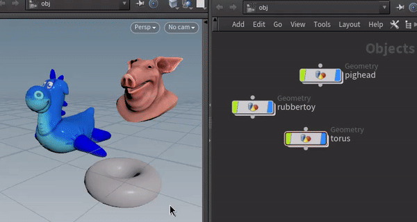
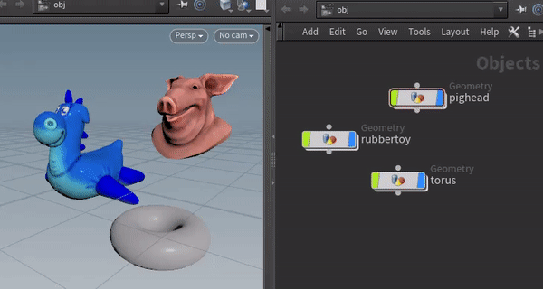
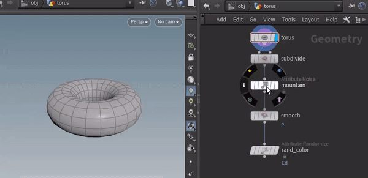

<link rel="stylesheet" href="assets/css/style.css">

# 

  

## What's this about?

**Houdini UX** *(pronounced`"hoodeenee-yoo-ex"`)* is a **collection of Usability helpers** that I've been missing in Houdini, such as:

### Isolate Selection

- Mimics the Maya/Softimage "Isolate Selection" workflow at the Objects level.
  

### Toggle Object Display

- Toggles the visibility state of selected Objects:
  

### Quick Display

- Let's you **store** and **load active/visible nodes** in SOP's. 
  This is intended to sort of mimic the UX behaviour of **Nuke's viewer** shortcuts. 
  _(→ `1`, `2`, `3`)_
  

### And a few more:

- **Parent** & **Unparent** selected objects.
- **Reset Transform** of selected objects.
- **Pickwalking** and **Hierarchy walking**.  (→ `up`, `down`, `left`, `right`)
- **Toggle FullScreen**.