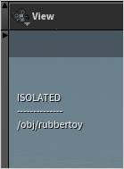

<link rel="stylesheet" href="../assets/css/style.css">

# Isolate Selection

---
### → Demo Hotkey:  `Alt + I`

---
Mimics the Maya/Softimage “Isolate Selection” workflow at the Objects level.

- This is purely a **Viewport Visibility** modification, **display flags** of objects are **not affected**.

- In **Cameras** all **isolated objects** get listed in the **top left corner of the viewport**:\
  \
  _(→ Unfortunately this does not seem to be possible in orthographic viewports...)_ 

- Try to **not save scenes in a viewport-isolated state**.\
  The isolation state "sort-of" persists in a weird way, and I've found that you often need to **close and re-create the "Scene View"** after scene load, to fix things.