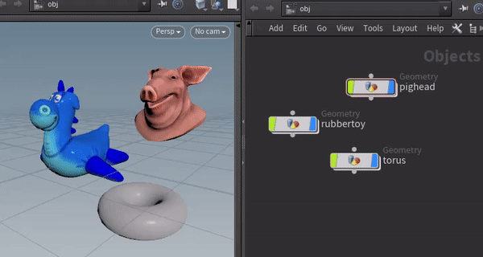

<link rel="stylesheet" href="../assets/css/style.css">

# Toggle Objects Display

---
### → Demo Hotkey:  `Alt + H`

---
Toggles the individual **visibility states** of selected Objects:

- In contrast to [Isolate Selection](../isolate-selection/) this actually **toggles the individual display flags** of selected Objects.

- Naturally this only works in **Objects** mode.

- Let's you easily `'A/B'` things by **multi-selecting one visible and one hidden object**, and repeatedly hitting `Alt+H`.
